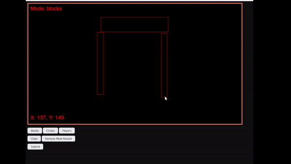
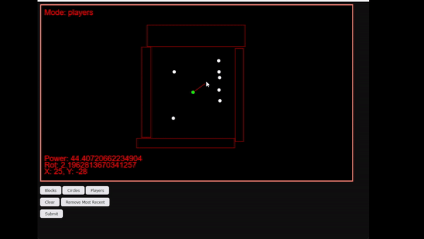

# Rapier Example UI
A project to hold a front end to use the Rapier Example project, which by 
design does not use Bevy. It will allow you to draw a scene and moving 
objects then submit to an API which will render an MP4 and return it. This 
project was put together very quickly and is not intended to be a guide 
to best practice, it is designed to provide a simple way of creating 
renderable JSON file to pass into the renderer, as well as a webserver for
completing this action and returning the video, as well as intermediate
JSON file.  

### Run with Docker

After cloning the project you can run it using Docker:

```bash 
docker build -t rapier_examples .
docker run -ti -p 8000:8000 rapier_examples
```

Then access the page on [localhost:8000](localhost:8000)

### Usage

Click `Clear` to clear the scene. Draw `Blocks` and `Circles` where you
would like them to appear, then select `Players` and drag to add power
to the pending shots. (You are limited to 4 `Players`). `Circles` are just
`Players` with no power or rotation (so they will move if touched by not
on their own).





Once the scene is complete, hit the submit button. It will process the video
sending it to the server to run the renderer against it. When completed (it
can take up to a minute to render more complex scenes), you will see two 
buttons, to view either the video or the JSON that produced it. 